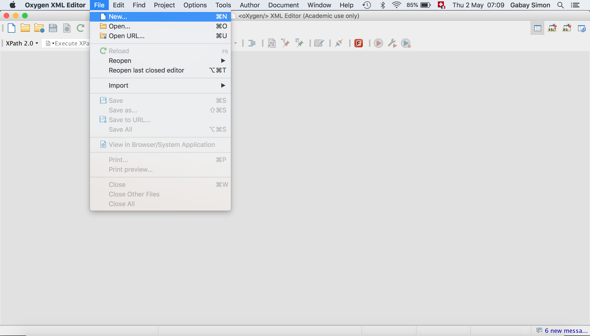
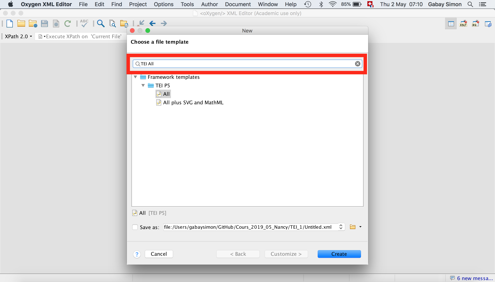
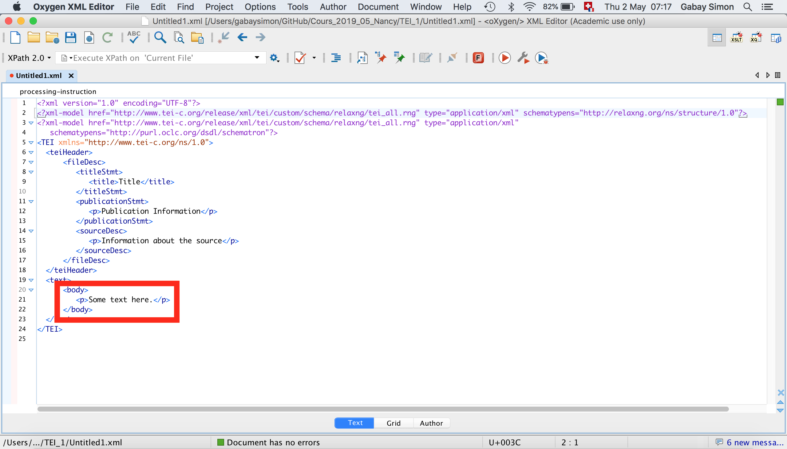

Formation EnExDi 2020

# TEI (1ère partie): un premier document en TEI: Exercices

Simon Gabay
Poitiers, mardi 11 février 2020

---

Créez votre premier document TEI.
1. Ouvrez Oxygen
2. Fichier>Nouveau


---
3. Une fenêtre s'ouvre Tapez "TEI P5 All" dans le champ de recherche, puis "Créer"


---
4. vous avez votre document TEI minimal. Vous n'allez travailler que sur la partie en rouge


---
5. Remplacez le contenu de ```<text>``` par le texte contenu de ```TEI_1.txt``` ([ici](https://github.com/gabays/Cours_Nancy_2019/blob/master/TEI_1/TEI_1_exo/TEI_1.txt)), sachant que
	5.1 Un poème est contenu dans une balise ```<div>```
	5.2 Un titre est contenu dans une balise ```<head>```
	5.3 Une strophe est contenue dans une balise ```<lg>```
	5.4 Un vers est contenu dans une balise ```<l>```
6.  Si vous avez fini, vous pouvez utiliser des attributs
	6.1 L'élément ```<div>``` peut porter un attribut ```@type```. Dites que c'est un sonnet.
	6.2 L'élément ```<lg>``` peut porter un attribut ```@rhyme```. Précisez le schéma des rimes (_ABBA ABBA CCD_ …)
	6.3 Vous pouvez identifier les mots à la rime avec l'élément ```<rhyme>```, et un attribut ```@label``` permet d'identifier à quelle partie du schéma métrique le mot se rattache (_a_, _b_, _c_ ou _d_?)
